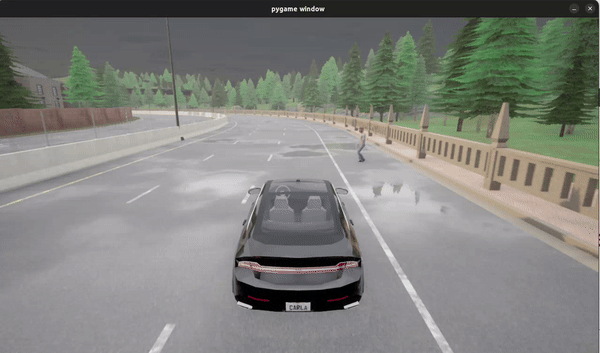

## Project - Scenario Generation


**Topic: Next Generation Autonomous Vehicle Scenario Generation - Enhancing Safety and Robustness with LLM Driven Solution**


### INTRODUCTION

Autonomous Vehicle perception models can fail under adversarial perturbations with dangerous consequences. For example, by attaching a subtle sticker on a stop sign, an AV can misinterpret it as something else like a Speed Limit 80 sign, which can lead to accidents. Exhaustive testing in the real world is costly and involves extensive data collection, which is impractical. So, simulated scenarios generation is needed. 

Current methods produce only limited scenario types, and often encounter obstacles, such as generation of non-executable code or calls to APIs that do not exist, primarily due to scarcity of code examples. LLMs contain a broad real-world knowledge that we can use to describe diverse safety-critical situations. 

The goal of this project is to use the capabilities of LLMs to bridge the gap between textual scenario descriptions and executable CARLA simulations. Basically, we are trying to generate Scenic code using Retrieval Augmented Generation (RAG) of code snippets database and then simulate it in CARLA. This idea is derived from the Paper - ChatScene which was published in the CVPR conference in May 2024.

### Recommended Stack

- Python 3.8.x (works with 3.10)
- Scenic 3.x
- CARLA 0.9.15

### Environment + Installation Checklist

1) Update and install Python 3.8
```Bash
sudo apt update
sudo apt install python3.8 python3.8-venv python3.8-dev
```

2) Create the environment using the specific 3.8 binary and activate it
```Bash
python3.8 -m venv ~/chatscene_env
source ~/chatscene_env/bin/activate  # need to run everytime when starting a new terminal
```

3) Verify it is correct
```Bash
python --version
# Output should be: Python 3.8.x
```

4) Upgrade pip + wheel (inside chatscene virtual env)
```Bash
pip install --upgrade pip setuptools wheel
```

5) Install Scenic
```Bash
pip install scenic
```

6) Install the CARLA Python client that matches the CARLA binary
```Bash
pip install carla==0.9.15
```

### Download and install CARLA 0.9.15

1) Go to https://github.com/carla-simulator/carla/releases/tag/0.9.15/ and download Ubuntu Carla 0.9.15 tar file and extract it in the project folder.

2) Now go to the CARLA folder and run the Carla server in a new terminal.
```Bash
cd ~/CARLA_0.9.15
./CarlaUE4.sh -prefernvidia
```

3) Run ```python3 test_connection.py``` (in the helper folder). The output should look like this:


### Install other python packages

```Bash
pip install sentence-transformers 
pip install google-genai numpy scikit-learn torch
```

### How to run and simulate Scenic code?

1. Make sure that CARLA 0.9.15 is installed and extracted.

2. Run the CARLA simulator by ```./CarlaUE4.sh -prefernvidia```

3. Run the Scenic code by:

```Bash
scenic sample.scenic --simulate --time 200
```

- ```--simulate``` component tells scenic to execute dynamic behaviour. Without this the scenic only generates the initial state but does not simulate in CARLA.

- ```--time 200``` component sets the maximum duration of the simulation. Here 200 means the simulation will run for 20 seconds.


### Results

1. **Scenario:** A pedestrian appears out of nowhere and crosses the road while an ego vehicle approaches.

<p float="left">
  
   
</p>

2. **Scenario:** A pedestrian appears out of nowhere and starts crossing the road when the ego vehicle turns left in a 4-way intersection.

<p float="left">
  
   
</p>

3. **Scenario:** The ego vehicle is following an adversarial car and it suddenly breaks causing collision with the ego vehicle.

<p float="left">
  
   
</p>